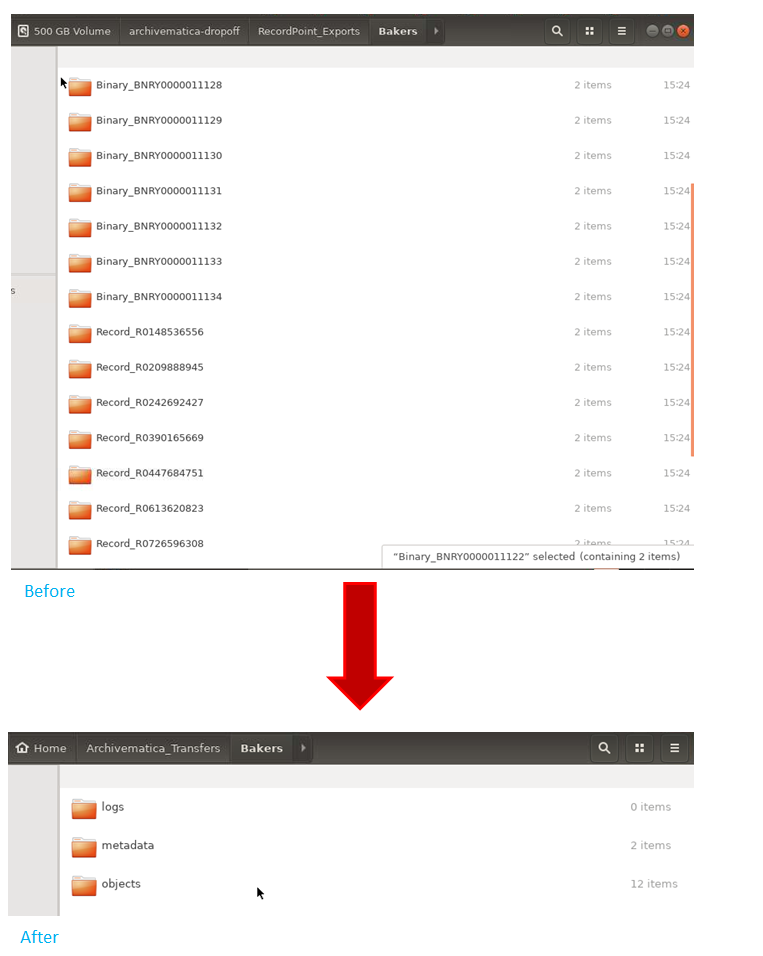
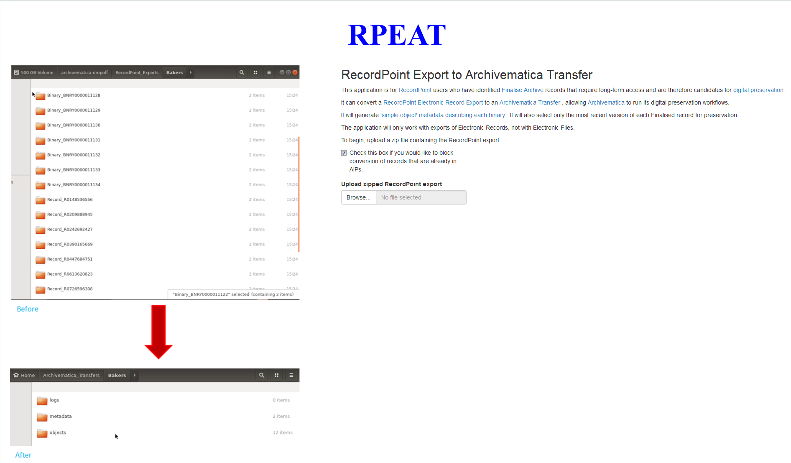
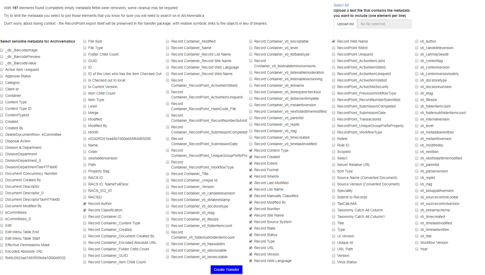
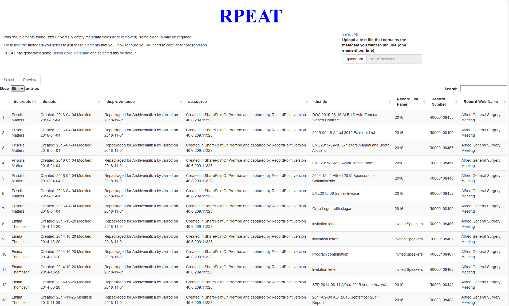
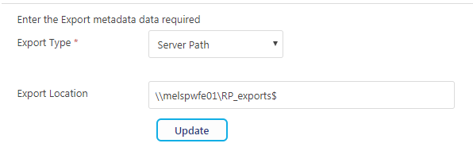

# RPEAT

## RecordPoint Export to Archivematica Transfer



## Why use RPEAT?

This application is for [RecordPoint](www.recordpoint.com) users who have identified [Finalise Archive](http://docs.recordpoint.com/display/R4/Finalise+and+Finalise+Archive+in+the+Active+Site) records that require long-term access and are therefore candidates for [digital preservation](http://www.dpconline.org/handbook).

## What RPEAT does

It can convert a [RecordPoint Electronic Record Export](http://docs.recordpoint.com/display/R4/Exporting+Records%2C+File+and+Boxes) to an [Archivematica Transfer](https://www.archivematica.org/en/docs/archivematica-1.6/user-manual/transfer/transfer/#create-submission), allowing [Archivematica](https://www.archivematica.org/en/) to run its digital preservation workflows and archivists to preserve the content long-term.

RPEAT also excludes previous versions of records from being included in the transfer package.

It will generate ['simple object' metadata describing each binary](https://www.archivematica.org/en/docs/archivematica-1.6/user-manual/transfer/import-metadata/#import-metadata) as well as submission documentation describing the conversion process and original export contents.

It also generates [Dublin Core Metadata](http://dublincore.org/documents/dces/) that can be included or excluded at the user's discretion.

## How RPEAT works

RPEAT uses the open source statistical programming language [R](https://www.r-project.org/), and the R package for building interactive web apps [Shiny](https://shiny.rstudio.com/), to scan a RecordPoint export and use that information to generate a transfer package compatible with Archivematica.

[ShinyProxy](https://www.shinyproxy.io/) provides authentication.

After the user selects a RecordPoint export from a list, Metadata is extracted from the export. As each record has its own XML file, this automation saves a lot of time. The user is then given the choice of what metadata to retain through an alphabetised checklist, or they can select what metadata they want by uploading their own file. The metadata selected will form the basis for the csv file that RPEAT will build as required by Archivematica. RPEAT then:

* Creates all directories required by Archivematica
* Creates the metadata CSV
* Copies the latest version of each record (or the most recently created binary) across

RPEAT will also add submission documentation, intended as [representation information](http://www.dcc.ac.uk/node/9558), to the transfer package, including the following:

* A text file,  'RecordPoint_Primer.txt' that contains information about RecordPoint to understand the export in context
* A text file, 'Stack_Info.txt' that contains system-generated information information about the environment in which RPEAT was run and the R session.
* A 'README.txt' file, to act as a guide to the submission documentation

This transfer package is created in /home/RecordPoint_Exports

The application will only work with exports of Electronic Records, not with Electronic Files.

## Screenshots







## Installation

On a server that has Archivematica installed, follow the below steps:

### Setup of the /home/RecordPoint_Transfers Transfer Source

First, you'll need to create a new directory for converted exports.

```bash
sudo mkdir /home/RecordPoint_Transfers
```

Make the owner of the directory the archivematica account.

```bash
sudo chown -R archivematica:archivematica /home/RecordPoint_Transfers
```

Also, make sure that whoever will be launching the ShinyProxy jar file is in the archivematica group!

```bash
sudo usermod -a -G archivematica [myname]
```

Following [Artefactual's documentation for adding a new Transfer Source](https://www.archivematica.org/en/docs/storage-service-0.12/administrators/#id12), add the local filesystem source /home/RecordPoint_Transfers.

### Setup of ShinyProxy

Create a new group called shiny-admins.

```bash
sudo groupadd shiny-admins
```

Add yourself to the group.

```bash
sudo usermod -a -G shiny-admins [myname]
```

Navigate to /opt.

```bash
cd /opt
```

Clone the repository.

```bash
sudo git clone https://github.com/jarrodharvey/rpeat
```

Assign the shiny-admins group to the newly created folder.

```bash
sudo chown -R root:shiny-admins /opt/rpeat
```

Give the shiny-admins group the required permissions.

```bash
sudo chmod -R g+swrx /opt/rpeat
```

Block access for other users.

```bash
sudo chmod -R o-rx /opt/rpeat
```

Log out and log back in. Now set your new group affiliation.

```bash
su [myname]
```

Navigate to the directory.

```bash
cd /opt/rpeat
```

Now, you need Docker. Follow the [installation instructions](https://docs.docker.com/install/).

Add yourself to the docker group if you haven't already.

```bash
sudo usermod -a -G docker myname
```

ShinyProxy needs to connect to the docker daemon to spin up the containers for the Shiny apps. By default ShinyProxy will do so on port 2375 of the docker host. In order to allow for connections on port 2375, the startup options need to be edited.

Follow the [Docker startup options instructions](https://www.shinyproxy.io/getting-started/) on the ShinyProxy website.


Create a docker network called "dockernet". This will allow the container to connect to archivematica's elasticsearch port and prevent duplication of digital objects. The application.yml file sets the RPEAT container as part of the dockernet group.

```bash
docker network create -d bridge --subnet 192.168.0.0/24 --gateway 192.168.0.1 dockernet
``` 

Build the RPEAT container.

```bash
docker build -t rpeat .
```
Before installing ShinyProxy, make sure that the container installed correctly.

```bash
docker run --network dockernet -p 3838:3838 rpeat R -e "shiny::runApp('/root/RPEAT')"
```

Now go to port 3838 of your Archivematica machine. Stop the container if the installation was successful. If you can't view the app then check your firewall settings.

You now have a container ready, time to set up ShinyProxy to allow authenticated access.

Go to the [downloads page](https://www.shinyproxy.io/downloads/) and download the file.

```bash
wget https://www.shinyproxy.io/downloads/shinyproxy-[version].jar
```

Now try running it!

```bash
java -jar shinyproxy-[version].jar
```
Log in to port 8080 on your server. If you don't see anything then check your firewall.

Finally, test converting a small RecordPoint export to make sure everything works as expected. Delete it if you are satisfied.

If everything works well then you can run the command in the background instead:

```bash
nohup java -jar shinyproxy-[version].jar &>/dev/null &
```

### Optional: mount the RecordPoint exports folder in the server for a more automated workflow ###

If you have the required permissions, you may wish to mount the RecordPoint exports folder directly on the archivematica server. RPEAT will look for /mnt/RecordPoint_Exports and if there are folders within will replace the zip upload button with a drop-down list containing all exports.

To set this up, to to Management > Settings > General in RecordPoint to find out the export location.



Now that you know where they are, create the mount directory.

```bash
sudo mkdir /mnt/RecordPoint_Exports
```

Mount the RecordPoint exports folder.

```bash
sudo mount -o username=[username],password=[password] [recordpoint server]\[export location] /mnt/RecordPoint_Exports
```

